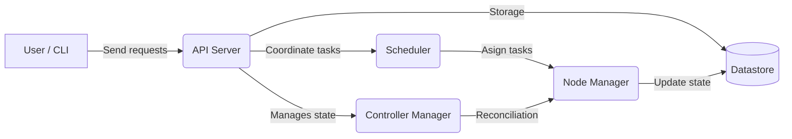
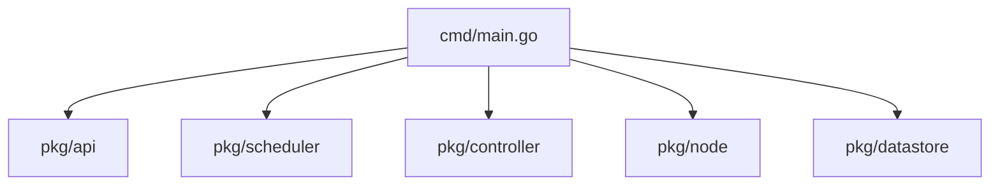

# container-orchestrator
Application that simulates the basic operation of Kubernetes.

## 🗂️ How it works

```mermaid
graph LR
    A[User / CLI] -->|Send requests| B(API Server)
    B -->|Coordinate tasks| C(Scheduler)
    B -->|Manages state| D(Controller Manager)
    C -->|Asign tasks| E(Node Manager)
    D -->|Reconciliation| E
    B -->|Storage| F[(Datastore)]
    E -->|Update state| F
```

## 📂 Project structure

```mermaid
graph TD
    A[cmd/main.go] --> B[pkg/api]
    A --> C[pkg/scheduler]
    A --> D[pkg/controller]
    A --> E[pkg/node]
    A --> F[pkg/datastore]
```