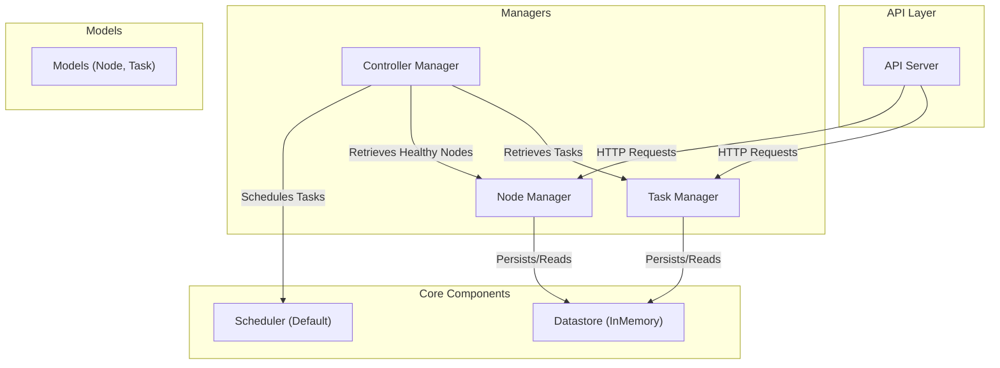
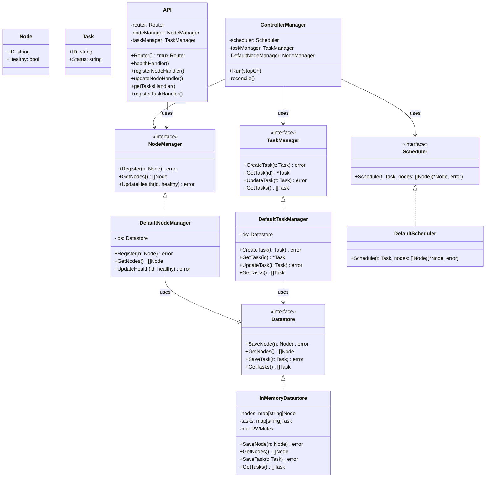

# container-orchestrator
A basic container orchestrator system built in Go that manages nodes and tasks. This application simulates some of the core functionalities found in systems like Kubernetes, including scheduling tasks to nodes, managing the state of nodes and tasks, and exposing a RESTful API for external interaction.

## Functionalities

- **API Server**:
  Exposes HTTP endpoints to:
  - Check service health (`/health`)
  - Manage nodes:
    - List all nodes (`GET /nodes`)
    - Register a new node (`POST /nodes`)
    - Update node health (`PUT /nodes/{id}`)
  - Manage tasks:
    - List all tasks (`GET /tasks`)
    - Create a new task (`POST /tasks`)

- **Node Manager**: Manages the registration, updating, and retrieval of nodes. It uses an in-memory datastore for persistence.

- **Task Manager**: Handles the lifecycle of tasks including creation, update, and retrieval. Also persists task state using the datastore.

- **Scheduler**: Implements a basic scheduling algorithm that assigns tasks to nodes. The default scheduler assigns tasks to the first available healthy node.

- **Controller Manager**: Runs a reconciliation loop that retrieves tasks from the Task Manager and healthy nodes from the Node Manager, then uses the Scheduler to assign tasks to nodes.

- **Datastore**: Provides an in-memory persistence layer for nodes and tasks. Both the Node Manager and Task Manager interact with the datastore to store and retrieve state.

## Limitations

**In-Memory Datastore:**

The current implementation uses an in-memory datastore, which means:

- All state is lost when the application restarts.
- It is not suitable for production environments that require persistence and fault tolerance.

**Basic Scheduling:**

The scheduling algorithm is rudimentary:

- It simply assigns tasks to the first available node without considering resource constraints, load balancing, or advanced scheduling strategies.

**Limited API Endpoints:**

The API currently provides only basic operations. There is no authentication, advanced filtering, or detailed status reporting.

**No Real Container Management:**

This system is a simulation of an orchestrator. It does not actually deploy or manage containers.

## Possible Improvements

**Persistent Datastore:**

Integrate a persistent datastore (e.g., etcd, PostgreSQL) to maintain state across restarts and scale horizontally.

**Advanced Scheduling:**

Enhance the scheduling logic to consider:

- Resource usage (CPU, memory)
- Load balancing between nodes
- Prioritization of tasks based on custom policies

**Enhanced API:**

Expand API endpoints to include:

- Detailed task and node status
- Filtering and querying capabilities
- Authentication and authorization mechanisms

**Container Integration:**

Integrate with container runtimes (like Docker or containerd) to actually schedule and manage containerized workloads.

**Monitoring & Logging:**

Implement monitoring, logging, and alerting mechanisms to observe the health and performance of the system.

## Architecture diagram



## Class diagram



## Getting started

### Running the application

```bash
go run cmd/main.go
```

The API server will start on port 8080. You can access the endpoints using cURL, Postman, or your preferred HTTP client.

### Running tests

```bash
go test -v ./...
```