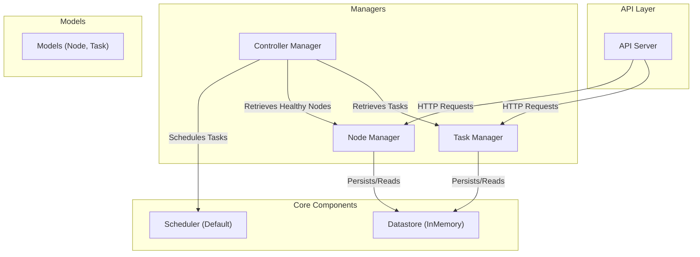
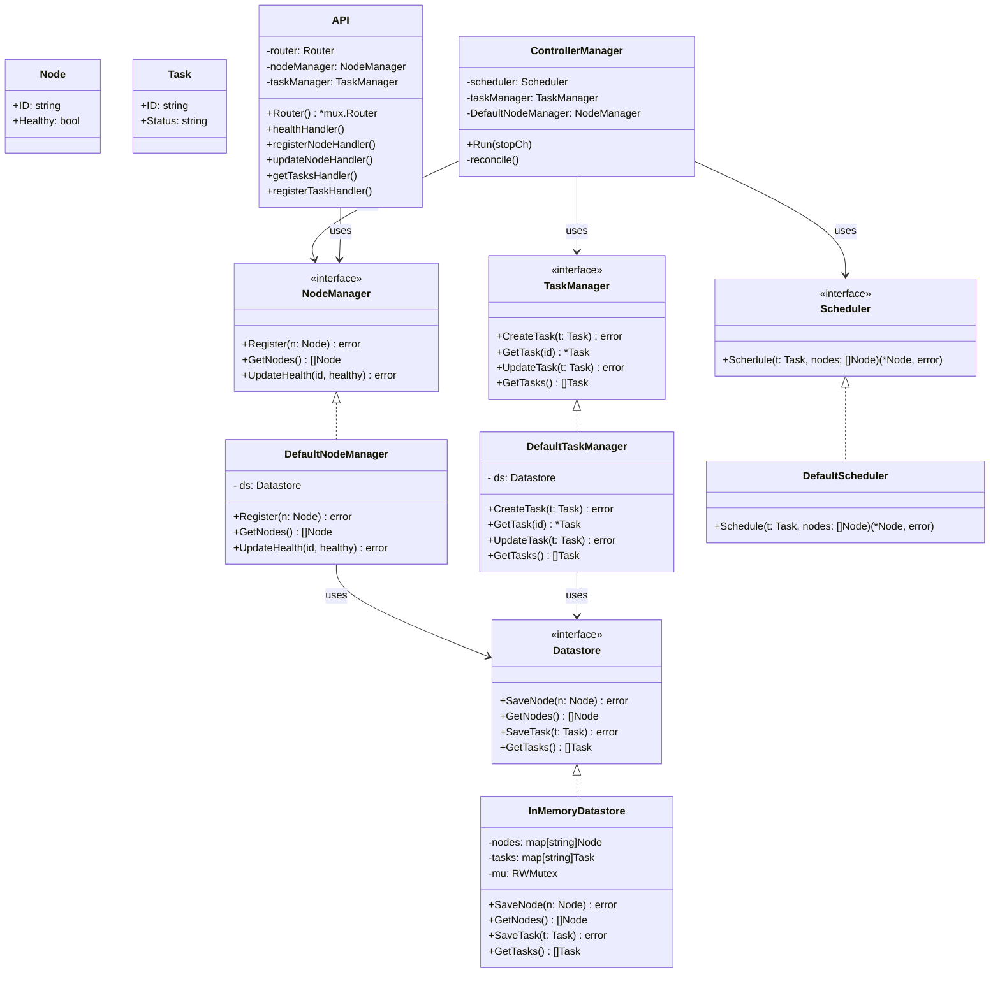
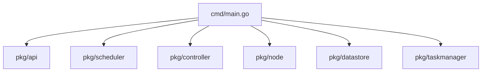

# container-orchestrator
Application that simulates the basic operation of Kubernetes.

## 🗂️ How it works

**Arquitecture diagram**

```mermaid
graph TD
    subgraph "API Layer"
      A["API Server"]
    end

    subgraph "Managers"
      NM["Node Manager"]
      TM["Task Manager"]
      CM["Controller Manager"]
    end

    subgraph "Core Components"
      S["Scheduler (Default)"]
      DS["Datastore (InMemory)"]
    end

    subgraph "Models"
      M["Models (Node, Task)"]
    end

    A -->|HTTP Requests| NM
    A -->|HTTP Requests| TM
    CM -->|Schedules Tasks| S
    CM -->|Retrieves Healthy Nodes| NM
    CM -->|Retrieves Tasks| TM
    NM -->|Persists/Reads| DS
    TM -->|Persists/Reads| DS
```

**Class diagram**

```mermaid
classDiagram
    class Node {
      +ID: string
      +Healthy: bool
    }
    class Task {
      +ID: string
      +Status: string
    }
    class Datastore {
      <<interface>>
      +SaveNode(n: Node) error
      +GetNodes() []Node
      +SaveTask(t: Task) error
      +GetTasks() []Task
    }
    class InMemoryDatastore {
      -nodes: map[string]Node
      -tasks: map[string]Task
      -mu: RWMutex
      +SaveNode(n: Node) error
      +GetNodes() []Node
      +SaveTask(t: Task) error
      +GetTasks() []Task
    }
    class NodeManager {
        <<interface>>
        +Register(n: Node) error
        +GetNodes() []Node
        +UpdateHealth(id, healthy) error
    }
    class DefaultNodeManager {
        - ds: Datastore
        +Register(n: Node) error
        +GetNodes() []Node
        +UpdateHealth(id, healthy) error
    }
    class TaskManager {
        <<interface>>
        +CreateTask(t: Task) error
        +GetTask(id) *Task
        +UpdateTask(t: Task) error
        +GetTasks() []Task
    }
    class DefaultTaskManager {
        - ds: Datastore
        +CreateTask(t: Task) error
        +GetTask(id) *Task
        +UpdateTask(t: Task) error
        +GetTasks() []Task
    }
    class Scheduler {
      <<interface>>
      +Schedule(t: Task, nodes: []Node) (*Node, error)
    }
    class DefaultScheduler {
      +Schedule(t: Task, nodes: []Node) (*Node, error)
    }
    class ControllerManager {
      -scheduler: Scheduler
      -taskManager: TaskManager
      -DefaultNodeManager: NodeManager
      +Run(stopCh)
      -reconcile()
    }
    class API {
        -router: Router
        -nodeManager: NodeManager
        -taskManager: TaskManager
        +Router() *mux.Router
        +healthHandler()
        +registerNodeHandler()
        +updateNodeHandler()
        +getTasksHandler()
        +registerTaskHandler()
    }
    
    Datastore <|.. InMemoryDatastore
    Scheduler <|.. DefaultScheduler
    TaskManager <|.. DefaultTaskManager
    NodeManager <|.. DefaultNodeManager
    DefaultNodeManager --> Datastore : uses
    DefaultTaskManager --> Datastore : uses
    ControllerManager --> Scheduler : uses
    ControllerManager --> NodeManager : uses
    ControllerManager --> TaskManager : uses
    API --> NodeManager : uses
```

## 📂 Project structure

```mermaid
graph TD
    A[cmd/main.go] --> B[pkg/api]
    A --> C[pkg/scheduler]
    A --> D[pkg/controller]
    A --> E[pkg/node]
    A --> F[pkg/datastore]
    A --> G[pkg/taskmanager]
```