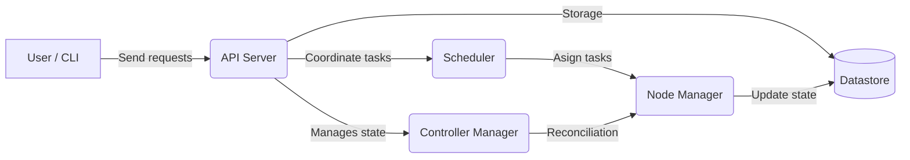
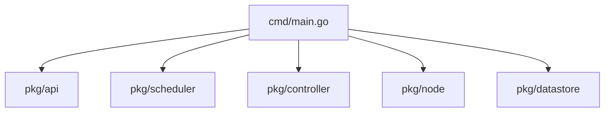
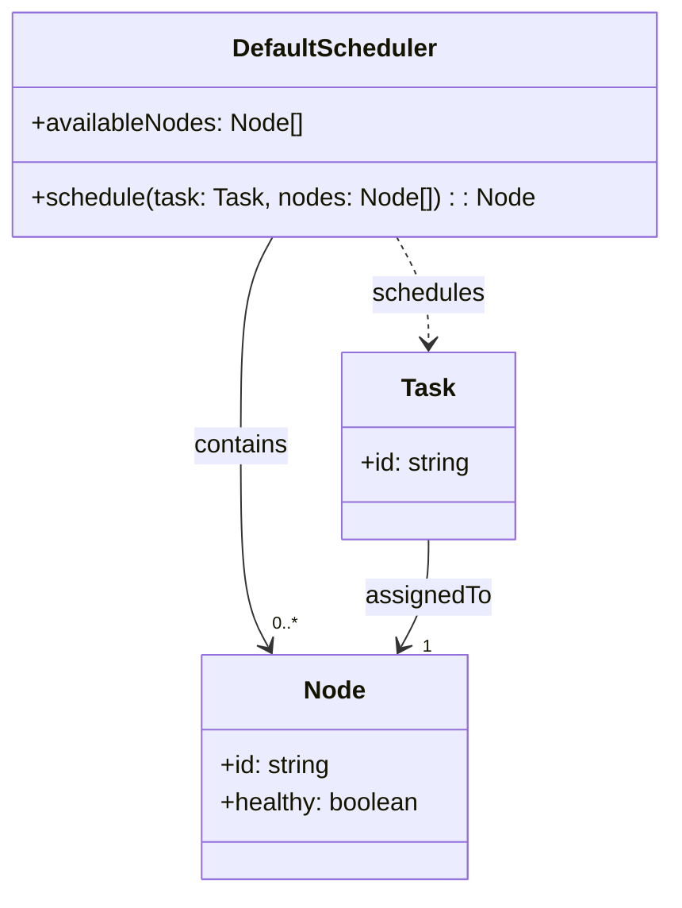
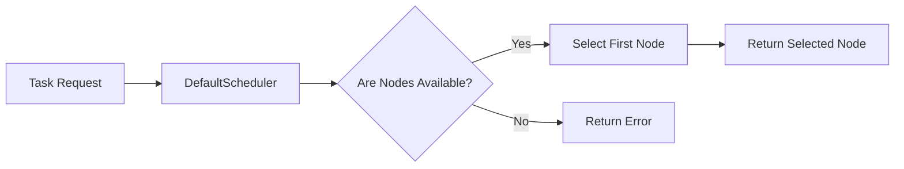
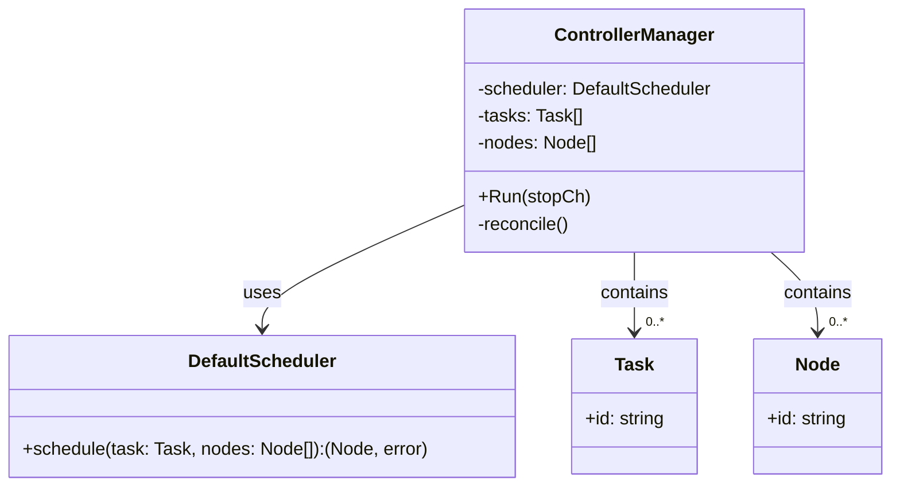
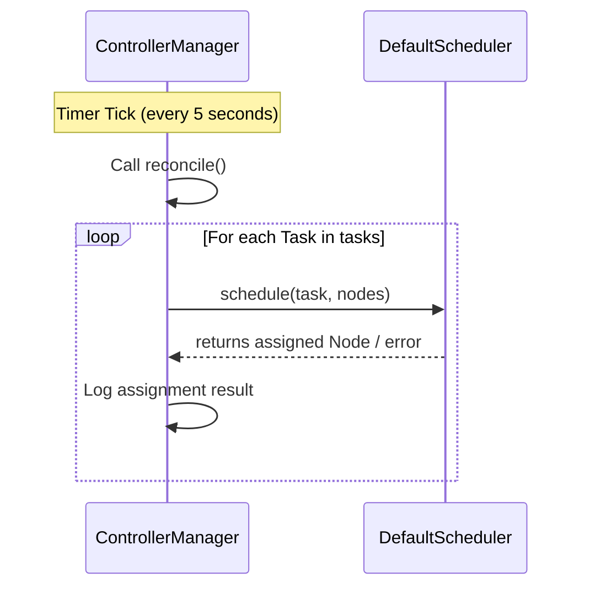
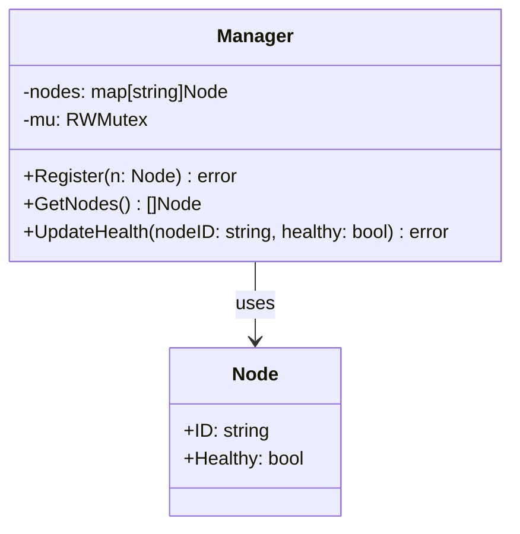
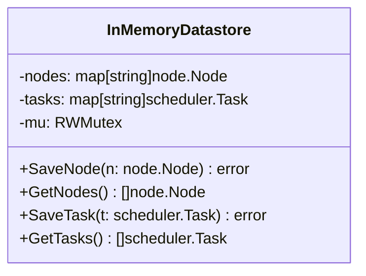

# container-orchestrator
Application that simulates the basic operation of Kubernetes.

## 🗂️ How it works

>  TODO: Revisar si esto es asi de verdad

## 📂 Project structure

### 🗓️ Scheduler

**Class diagram**

**Sequence diagram**

### 🎮 Controller

**Class diagram**

**Sequence diagram**

### 👮‍♀️ Node manager

**Class diagram**

### 📀 Datastore

**Class diagram**

